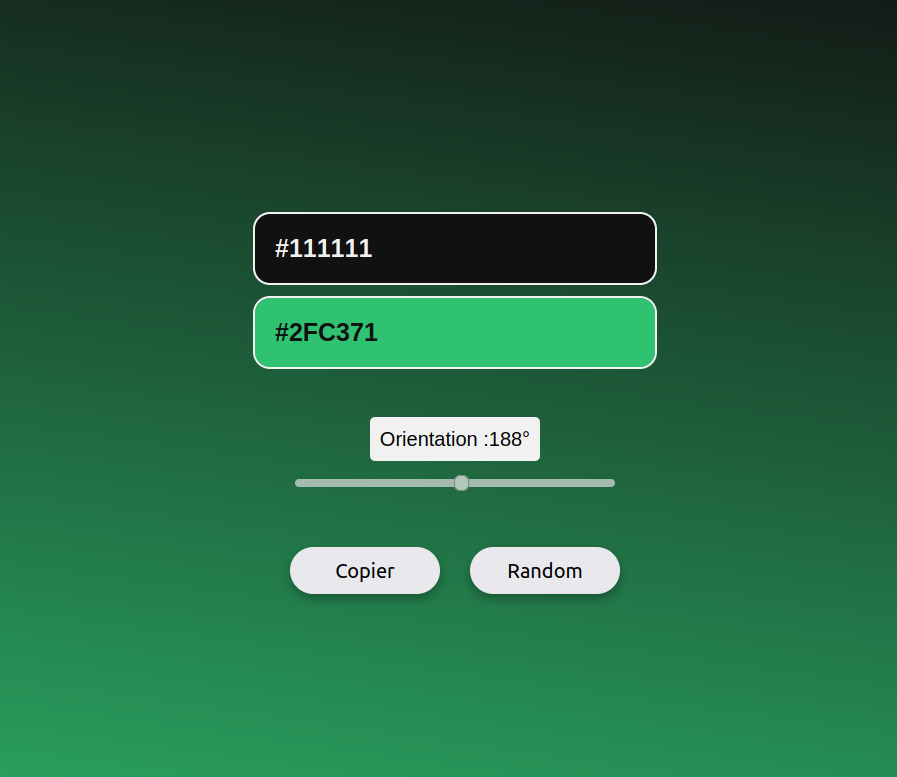

# Color Gradient

J'ai réalisé un outil qui permet de créer des dégradés de couleurs linéaires. Le tout avec du javascript.
On peut choisir des couleurs de départ et l'orientation. On peut aussi copier le code css qui représente le dégradé. "linear-gradient(xdeg, color1, color2)".
Enfin, on peut appuyer sur un ou bouton pour générer une couleur aléatoire.

Problème à régler : Parfois le dégradé ne s'actualise pas.

